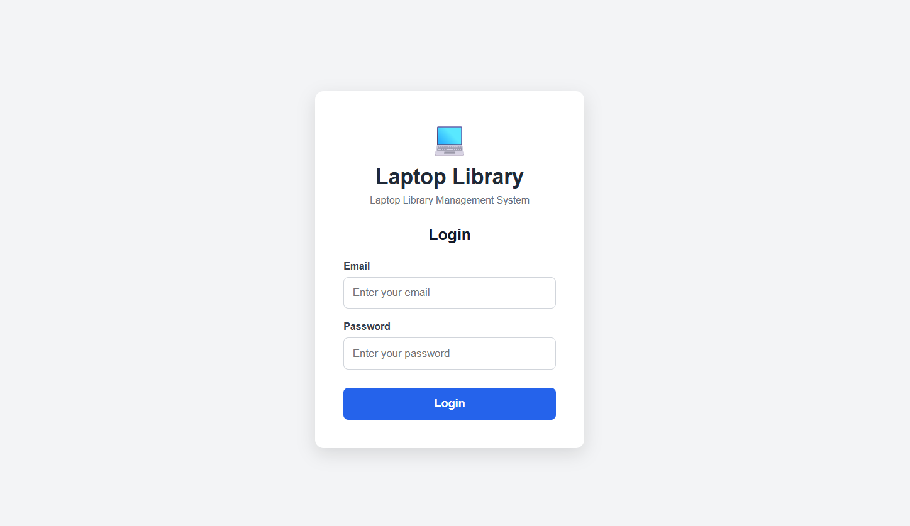
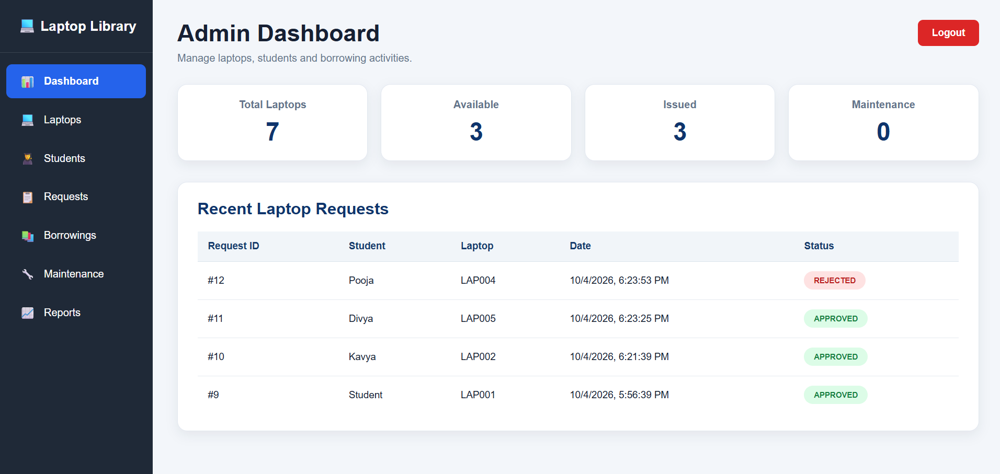
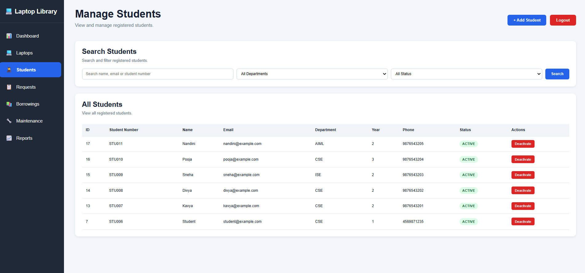
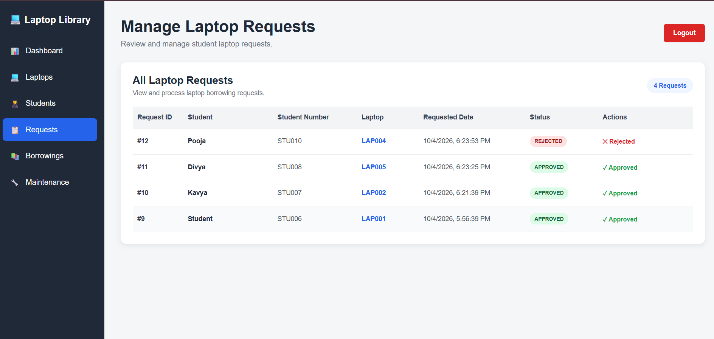

# 💻 Laptop Library Management System

A web-based Laptop Library Management System designed to simplify and manage the process of issuing, borrowing, returning, and maintaining laptops within an educational institution.

The system provides separate interfaces for **Administrators** and **Students**, making laptop management more organized, secure, and efficient.

---

## 📌 Project Overview

The Laptop Library Management System allows students to:

- View available laptops
- Request a laptop
- Track their laptop requests
- View their current borrowing details
- View borrowing history
- Monitor the return deadline

Administrators can:

- Manage laptops
- Manage students
- Manage laptop requests
- Manage borrowings
- Manage maintenance records
- View reports
- Monitor system activity

---

## 👥 User Roles

### 👨‍💼 Administrator

Administrators can:

- View dashboard statistics
- Add and manage laptops
- Edit laptop information
- Activate/deactivate laptops
- Add and manage students
- Activate/deactivate student accounts
- Approve or reject laptop requests
- Manage laptop borrowings
- Track laptop maintenance
- View reports
- Monitor system activity

### 👩‍🎓 Student

Students can:

- Login securely
- View available laptops
- Request a laptop
- Track request status
- View currently borrowed laptop
- View borrowing history
- Monitor return deadlines

---

## ✨ Key Features

### 🔐 Authentication

- Secure login system
- Password hashing using bcrypt
- JWT-based authentication
- Role-based access control
- Protected API routes
- Login rate limiting

### 💻 Laptop Management

Administrators can:

- Add new laptops
- Edit laptop details
- View laptop availability
- Activate/deactivate laptops
- Track laptop status

Example laptop information:

- Laptop Code
- Brand
- Model
- Processor
- RAM
- Storage
- Operating System
- Status

### 👨‍🎓 Student Management

Administrators can:

- Add students
- Search students
- Filter students
- View student details
- Activate/deactivate student accounts

### 📋 Laptop Requests

Students can submit laptop requests.

Administrators can:

- View pending requests
- Approve requests
- Reject requests
- Track request status

### 📚 Borrowing Management

The system maintains borrowing information including:

- Student
- Laptop
- Issue date
- Due date
- Return status

The borrowing period is **3 days**.

### 🔧 Maintenance

Administrators can manage laptop maintenance information and track laptops that require servicing.

### 📊 Dashboard & Reports

The administrator dashboard provides an overview of the system, including information about:

- Total laptops
- Available laptops
- Borrowed laptops
- Students
- Requests
- Maintenance

---

## 🛠️ Technology Stack

### Frontend

- React.js
- JavaScript
- HTML
- CSS
- React Router

### Backend

- Node.js
- Express.js

### Database

- MySQL

### Authentication & Security

- JWT
- bcrypt
- Helmet
- Express Rate Limit
- Express Validator
- CORS

### Development Tools

- Visual Studio Code
- Postman
- Git
- GitHub

---

## 📸 Screenshots

### 🔐 Login Page



### 👨‍💼 Admin Dashboard



### 👨‍🎓 Student Dashboard


### 💻 Manage Laptops


### 👥 Manage Students



### 📋 Manage Requests



## 📁 Project Structure

```text
Laptop-Library-Management-System/
│
├── frontend/
│   ├── src/
│   │   ├── pages/
│   │   ├── components/
│   │   ├── App.jsx
│   │   └── ...
│   │
│   └── package.json
│
├── server.js
├── package.json
├── package-lock.json
├── .gitignore
└── README.md